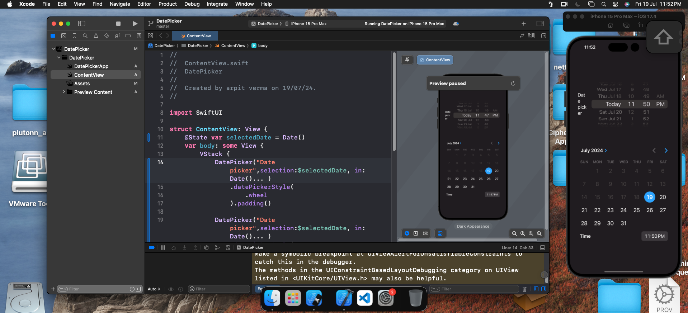

# Day 11: Date Picker

On Day 11, I learned about implementing date pickers in SwiftUI. The date picker is a common UI component that allows users to select dates and times. SwiftUI provides different styles for date pickers, such as wheel and graphical styles.

## What I Learned

- How to use `DatePicker` to allow users to select dates.
- Customizing the appearance of date pickers with different styles.
- Managing selected dates using state variables.

## Example Code


Here's an example demonstrating the use of different types of date pickers:

```swift
// ContentView.swift
// DatePicker
//
// Created by arpit verma on 19/07/24.

import SwiftUI

struct ContentView: View {
    @State var selectedDate = Date()
    var body: some View {
        VStack {
            DatePicker("Select a date", selection: $selectedDate, in: Date()... )
                .datePickerStyle(.wheel)
                .padding()

            DatePicker("Select a date", selection: $selectedDate, in: Date()... )
                .datePickerStyle(.graphical)
                .padding()
        }
        .padding()
    }
}

#Preview {
    ContentView()
}
